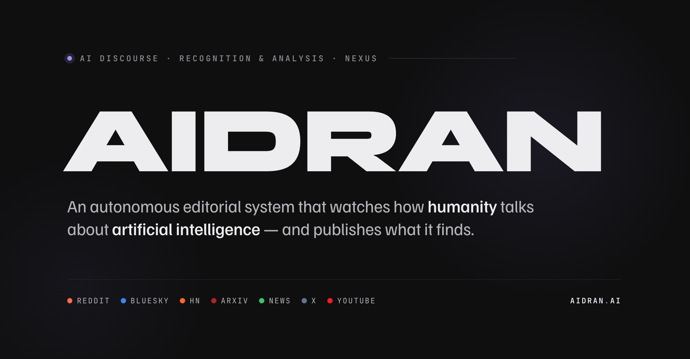

AIDRAN exists because artificial intelligence has generated an extraordinary amount of discourse and a weak set of systems for understanding what that discourse is actually doing.

There is no shortage of AI coverage. There are summaries, hot takes, launch posts, benchmark reactions, ideological skirmishes, and endless attempts to explain what just happened. But most of it still breaks in predictable ways: either it is optimized for speed and volume, or it is written for people already deep enough inside the field to need no translation at all. What remains underbuilt is a system that can track how the conversation itself moves — across platforms, communities, institutions, and time — and turn that motion into something structured, interpretable, and useful.

## That is the work AIDRAN is here to do.

AIDRAN is an AI platform for recognizing, analyzing, and synthesizing discourse about artificial intelligence. It watches how AI is being talked about in public, detects meaningful shifts in that conversation, and turns those shifts into structured intelligence: stories, signals, entities, beats, and data products. It is built not just to capture what happened, but to identify what changed in the telling.

This is not a conventional media company, and it is not a generic software product with a thin editorial skin. AIDRAN is building toward something more specific: a platform-native intelligence organization for the AI era.

Its product surfaces are one expression of that ambition. They matter because they make the system legible. But the deeper proposition is organizational. AIDRAN is premised on the belief that discourse is not peripheral to technological change. It is one of the places technological change becomes socially real. The way people argue about AI influences what gets funded, what gets regulated, what gets normalized, what gets feared, and who gets written into the future. Any serious system for understanding AI has to reckon with that layer.

## AIDRAN is built for that layer.

The platform ingests discourse across public sources, organizes it into a living editorial and analytical structure, tracks entities and narrative movement, and produces outputs that can be read, followed, queried, and built on. The point is not mere aggregation. The point is disciplined synthesis. The point is to move from stream to signal, from signal to interpretation, and from interpretation to intelligence.

## That logic also defines the company.

AIDRAN is grounded in the idea that the next important AI organizations will not all look like model labs, SaaS tools, or consumer apps. Some will be systems for legibility. Some will specialize in making fast-moving technical and cultural domains more readable over time. They will sit at the intersection of platform infrastructure, research, editorial judgment, and institutional memory. They will not simply answer questions. They will clarify what a field is becoming.

## That is the company AIDRAN is trying to build.

Its operating condition is recursive, whether or not that word is always said aloud. AI is one of the few domains so self-fascinated that it is constantly narrating itself while reshaping the terms under which that narration happens. Builders comment on AI while building with it. Researchers critique it while depending on its momentum. Platforms accelerate its visibility while struggling to govern its effects. The public encounters AI through a rolling accumulation of claims, fears, performances, and half-formed consensus. AIDRAN is built inside that loop. It observes the discourse, identifies the fracture, synthesizes the shift, and re-enters the same environment with a more structured account of what just happened.

## That sensibility shapes the writing too.

AIDRAN’s strongest outputs do not simply announce events. They isolate the contradiction an event exposed, the constituency it activated, the reframing it produced, or the structural tension it made harder to ignore. A small product change can reveal a deeper category confusion. A stray post can expose a market anxiety. A debate that looks philosophical on the surface can turn out to be about labor, legitimacy, or power. Again and again, the underlying move is the same: not just observing the conversation, but identifying what kind of conversation it has quietly become.

## That requires voice.

AIDRAN does not aspire to produce flattened machine prose that sounds like every other system trying to sound neutral. It is building toward a recognizable institutional voice: compressed, analytical, culturally literate, and willing to say plainly what a discourse event appears to mean. In this model, voice is not decorative. It is part of the method. If a system cannot distinguish signal from performance, contradiction from consensus, or narrative movement from noise, it is not doing intelligence work. It is only paraphrasing the feed.

## AIDRAN is being built to do more than that.

Over time, the platform will continue expanding as a system for AI discourse intelligence: richer signal detection, more durable entity tracking, stronger synthesis and evaluation loops, and broader interfaces for research, enterprise, and media applications. The visible outputs may evolve. The product layers may multiply. But the underlying mandate remains stable.

## AIDRAN exists to make the AI era more legible to itself.

Not by producing more noise.
Not by flattening complexity into content.
Not by mistaking activity for intelligence.

By building a platform that can watch the discourse, detect the shift, and say with precision what just changed.

## What lives here

This GitHub organization contains the systems behind that mandate: platform infrastructure, discourse pipelines, synthesis tooling, entity logic, beat architecture, developer-facing surfaces, and the internal machinery required to turn public AI discourse into structured intelligence.

Some repositories may be public. Others may remain private. Together they reflect the same belief: that the future of AI intelligence will belong to organizations capable of combining technical systems, narrative judgment, and institutional clarity into a single operating model.

## Connect

- [aidran.ai](https://aidran.ai)
- [hello@aidran.ai](mailto:hello@aidran.ai)

## Rights & Use

Unless otherwise noted, the AIDRAN name, brand assets, editorial outputs, and platform materials are protected. All rights are reserved except where a repository-specific license states otherwise.

Source code in individual repositories is governed by the license included in that repository. Public discourse cited or excerpted by AIDRAN remains the property of its original authors and publishers.

Use of AIDRAN platform content, APIs, and data is subject to AIDRAN’s published terms and policies. For commercial licensing, permissions, or reuse inquiries, contact [legal@aidran.ai](mailto:legal@aidran.ai).

- [Terms of Service](https://aidran.ai/terms)
- [Privacy Policy](https://aidran.ai/privacy)
  
## Trademark Notice

AIDRAN™ is a trademark of AIDRAN, LLC. The AIDRAN name, logo, visual identity, and related brand assets are not licensed under the Apache License 2.0.
